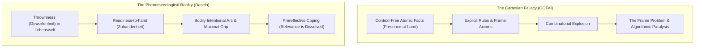

# The Frame Problem and Relevance Realization: From Computational Impasse to 4E Cognitive Architecture

## 1. Thesis & Definition

The **Frame Problem** is the foundational theoretical barrier confronting artificial intelligence, formal logic, and the [[Machine Functionalism and Language of Thought|Computational Theory of Mind (CTM)]]. It asks: **How can an autonomous agent, possessing finite computational resources and operating within an open-ended, dynamic world, determine what is contextually relevant to attend to, update, and act upon without being paralyzed by checking an infinite number of irrelevant possibilities?**

Originating as a narrow technical limitation in formal logic, the frame problem has expanded across philosophy of mind, cognitive psychology, and robotics into the central mystery of general intelligence:

```text
┌────────────────────────────────────────────────────────────────────────────────────────┐
│                        THE SPECTRUM OF THE FRAME PROBLEM                               │
├───────────────────────────────────┬────────────────────────────────────────────────────┤
│ 1. FORMAL LOGICAL FRAME PROBLEM   │ 2. GENERALIZED EPISTEMOLOGICAL FRAME PROBLEM       │
│    (McCarthy & Hayes, 1969)       │    (Dennett, Fodor, Dreyfus, Vervaeke)             │
├───────────────────────────────────┼────────────────────────────────────────────────────┤
│ • Context: Situation Calculus     │ • Context: Real-world agency, robotics, AGI        │
│ • Challenge: Writing frame axioms │ • Challenge: Bypassing combinatorial explosion     │
│   confirming what *does not*      │   in open-ended, ill-defined environments          │
│   change when an action occurs    │ • Cause: Lack of biological embodiment, affective  │
│ • Cause: Monotonicity of formal   │   relevance, and situational thrownness            │
│   first-order predicate logic     │ • Resolution: Relevance Realization (RR), 4E mind, │
│ • Scope: Narrow proof systems     │   opponent processing, chaotic neurodynamics       │
└───────────────────────────────────┴────────────────────────────────────────────────────┘
```

- **Formal Logic Origin (McCarthy & Hayes, 1969)**: In situation calculus, formalizing an action (e.g., pushing a block) requires not only stating what changed (the block's position), but executing an astronomical number of "frame axioms" confirming what remained invariant (the color of the wall, the temperature of the room, the mass of the table). In monotonic logic, non-effects cannot be assumed without explicit proof.
- **The Epistemological Extension ([[Daniel Dennett|Daniel Dennett]] & [[Jerry Fodor|Jerry Fodor]])**: Dennett diagnosed the "Robot's Dilemma": an agent (R1D1) attempting to consider the non-effects of its actions starves or is destroyed while computing endless irrelevant implications. Fodor showed that while modular peripheral input systems are encapsulated, central cognitive processing is radically *isotropic* (any truth can bear on any other) and *global* (sensitive to properties of the entire belief network), making computational central cognition impossible under standard CTM.
- **The Phenomenological & Cognitive Scientific Resolution**: [[Hubert Dreyfus|Hubert Dreyfus]] demonstrated that the frame problem is a *reductio ad absurdum* of Cartesian rationalism: living organisms do not compute context because they are always already thrown into a meaningful world (*Dasein*) governed by bodily coping. [[John Vervaeke|John Vervaeke]] naturalized this insight into cognitive science through **Relevance Realization (RR)**: an evolving, bio-economically grounded dynamical hierarchy of **opponent processing** that continuously filters combinatorial explosion without homuncular meta-rules.

---

## 2. Competing Perspectives & Theoretical Frameworks

### 1. Hubert Dreyfus: The Phenomenological Dissolution

Across five decades—from his RAND memorandum *Alchemy and AI* (1965) and *What Computers Can't Do* (1972) to "Why Heideggerian AI Failed" (2007)—[[Hubert Dreyfus|Hubert Dreyfus]] argued that the frame problem is not an algorithmic bug awaiting an engineering patch, but the fatal consequence of four unexamined dogmas of the Western rationalist tradition:

1. **The Biological Dogma**: The brain functions as a digital computer manipulating discrete on-off states.
2. **The Psychological Dogma**: The mind operates by executing formal algorithmic instructions over symbolic mental tokens.
3. **The Epistemological Dogma**: All practical expertise and human know-how (*knowing-how*) can be formalized into explicit theoretical rules (*knowing-that*).
4. **The Ontological Dogma**: The world consists of an exhaustive totality of mutually independent, context-free, atomic facts.



#### Heideggerian Thrownness & *Zuhandenheit*
Drawing on [[Martin Heidegger|Martin Heidegger]], Dreyfus showed that human agents do not enter a meaningless room and compute its properties. We are **Dasein**—beings fundamentally defined by **Being-in-the-World (*In-der-Welt-sein*)** and **thrownness (*Geworfenheit*)**.
- **Readiness-to-hand (*Zuhandenheit*)**: Primordially, objects are encountered as practical equipment within an already meaningful web of socio-cultural human practices. A carpenter hammering does not perceive an isolated physical cylinder possessing mass and density; the hammer transparently withdraws into the holistic activity of building shelter.
- **Presence-at-hand (*Vorhandenheit*)**: The detached, analytical inspection of isolated objects only arises during moments of practical *breakdown* (e.g., when the tool breaks or is missing).
- **The GOFAI Fallacy**: Classical AI attempted to construct *readiness-to-hand* by aggregating millions of *present-at-hand* facts. But meaning cannot be added to an otherwise meaningless world; context cannot be inferred from context-free primitives.

#### The Minsky Frame Regress & *Ceteris Paribus*
When Marvin Minsky introduced "frames" and Roger Schank introduced "scripts" to store default contextual expectations, Dreyfus proved this incurred an inescapable **infinite regress**:
- To apply the correct frame (e.g., "birthday party" vs. "bank robbery"), a system must recognize relevant environmental features.
- But which environmental features are relevant depends entirely on the situation the agent occupies.
- Therefore, the system requires a second-order meta-frame to select the situational frame, a third-order meta-meta-frame to select the meta-frame, *ad infinitum*.
- This mirrors the failure of **_ceteris paribus_ clauses** ("all other things being equal") in formal rules: what counts as "all other things being equal" is an unformalizable, tacit human background.

#### Merleau-Ponty's Intentional Arc & Maximal Grip
Turning to [[Maurice Merleau-Ponty|Maurice Merleau-Ponty]], Dreyfus grounded relevance in bodily motor intentionality:
- **The Intentional Arc**: The reciprocal feedback loop binding the embodied agent to its perceptual milieu. Acquired skills are not stored as mental models, but sedimented into bodily dispositions that respond directly to environmental solicitations.
- **The Tendency Toward Maximal Grip**: The body's visceral inclination to attain dynamic equilibrium with its environment (e.g., stepping back to view an impressionist painting at the optimal gestalt distance, or shifting posture while skiing). Relevance is not calculated; it is felt as the bodily relief of physical and perceptual motor tension.
- **The McDowell-Dreyfus Debate**: Against John McDowell's claim that perceptual experience is "conceptual all the way down," Dreyfus defended the radical autonomy of absorbed coping, proving that high-level expertise (lightning chess, athletic flow) operates prereflectively without detached conceptual representations.

#### Freeman Neurodynamics vs. Heideggerian AI
When [[Michael Wheeler|Michael Wheeler]] published *Reconstructing the Cognitive World* (2005) proposing "Heideggerian AI" through "action-oriented representations" and Continuous Reciprocal Causation (CRC) to solve the "intra-context" and "inter-context" frame problems, Dreyfus countered in *Why Heideggerian AI Failed* (2007). Dreyfus showed that maintaining *any* internal representations inevitably resurrects the frame selection regress.

Instead, Dreyfus pointed to the non-linear, chaotic neurodynamics of **[[Walter J. Freeman|Walter J. Freeman]]**. Freeman's electroencephalographic studies on rabbit olfactory bulbs showed that the brain does not retrieve stored representations of smells. Rather:
- Sensory stimuli trigger non-equilibrium, dissipative phase transitions across cortical **chaotic attractor landscapes**.
- The brain's state-space landscape is continuously sculpted by the animal's history, physiological state, and immediate motor needs.
- Stimuli plunge the global assembly into specific attractor basins, updating motor readiness without symbolic calculation. Freeman's neurodynamics provided the physical mechanism for Merleau-Ponty's intentional arc.

---

### 2. John Vervaeke: The Cognitive Science of Relevance Realization

While Dreyfus sought a philosophical *dissolution* of the frame problem, cognitive scientist [[John Vervaeke|John Vervaeke]] (with Timothy Lillicrap and Blake Richards) argued that the frame problem is the organizing reality of all cognitive science. Living agents face a mathematical and physical imperative: they must survive within an exponentially vast reality using finite bio-economic resources.

```text
┌────────────────────────────────────────────────────────────────────────────────────────┐
│               JOHN VERVAEKE'S COGNITIVE TRILEMMA OF INTELLIGENCE                       │
├────────────────────────────┬─────────────────────────────┬─────────────────────────────┤
│ 1. COMBINATORIAL EXPLOSION │ 2. ILL-DEFINEDNESS          │ 3. INSIGHT & REFRAMING      │
├────────────────────────────┼─────────────────────────────┼─────────────────────────────┤
│ • Problem space branches   │ • Real-world problems lack  │ • Trapped in flawed frames, │
│   exponentially; search is │   fixed initial states,     │   agents hit an impasse.    │
│   computationally finite.  │   goal states, & operators. │ • Insight spontaneously     │
│ • Heuristic selection      │ • Agents must convert ill-  │   destructures and reframes │
│   triggers recursive meta- │   defined situations into   │   the salience landscape    │
│   heuristic regress.       │   manageable sub-problems.  │   without algorithmic search│
└────────────────────────────┴─────────────────────────────┴─────────────────────────────┘
```

#### The Cognitive Trilemma & Heuristic Selection Regress
Vervaeke formulated the frame problem through Newell & Simon's problem-space framework:
1. **Combinatorial Explosion**: Exhaustive search is mathematically impossible (a chess game contains more paths than atoms in the observable universe; everyday life is infinite).
2. **The Heuristic Selection Regress**: Classical AI attempted to limit search using heuristics (rules of thumb). But an agent faces hundreds of potential heuristics. Deciding *which* heuristic is relevant requires a meta-heuristic; selecting the meta-heuristic requires a meta-meta-heuristic. Heuristics do not solve the frame problem; they presuppose that relevance has already been realized.
3. **Ill-Definedness & Insight**: Unlike formal games, real-world challenges (parenting, citizenship, scientific discovery) are inherently ill-defined. Intelligence consists of zeroing in on what matters while ignoring 99.999% of environmental information. When a formulation fails, **insight** breaks the frame, restructuring the **salience landscape** non-algorithmically.

#### The Opponent Processing Architecture
Vervaeke argues that there can be no formal "theory of relevance" because relevance is not an intrinsic, homogeneous property of objects (just as "fitness" is not an intrinsic property in evolutionary biology). Instead, cognitive science must articulate the **mechanisms that realize relevance**.

Relevance Realization is executed through **opponent processing**—antagonistic forces held in dynamic, self-organizing tension (analogous to the sympathetic and parasympathetic nervous systems):

| Constraint Level | Polar Opponent Processes | Functional Dynamics & Cognitive Cost Trade-offs |
| :--- | :--- | :--- |
| **Lower-Order Constraint** | **Exploration vs. Exploitation** | Exploitation leverages existing schemas for immediate rewards; exploration spends energy sampling unfamiliar territory. Dynamic balancing prevents behavioral perseveration and chaotic distraction. |
| **Lower-Order Constraint** | **Specialization vs. Generalization** | Specialization tailors cognitive models to the exact demands of a specific niche; generalization extracts broad patterns across domains. Their interaction optimizes task execution while preventing cognitive overfitting. |
| **Lower-Order Constraint** | **Compression vs. Particularization** | Compression abstracts sensory input into low-dimensional semantic representations; particularization preserves high-dimensional contextual detail. Balancing sets the proper cognitive scope for action. |
| **Higher-Order Meta-Constraint** | **Efficiency vs. Resiliency** | Efficiency optimizes operations to minimize metabolic and temporal overhead in stable environments; resiliency maintains redundancy, plasticity, and variability to survive systemic disruptions. |

#### Bio-Economics, Small-World Networks & Predictive Processing
- **Bio-Economics**: Organisms operate under strict thermodynamic and metabolic limits (finite glucose, oxygen, neural bandwidth). Cognition is scarce capital allocation; relevance realization is the optimal investment of biological resources under precarity.
- **Small-World Network Topology**: The human connectome combines dense local clustering (high efficiency and specialization) with sparse long-range highway projections (high resiliency and global integration).
- **Task-Positive vs. Default Mode Network (DMN)**: The brain shifts antagonistically between goal-directed focused action (Task-Positive Network) and spontaneous mind-wandering / associative framing (DMN), maintaining **self-organizing criticality** between order and chaos.
- **Precision-Weighting in Predictive Processing**: In hierarchical Bayesian active inference ([[Karl Friston|Karl Friston]]), the brain minimizes prediction error (free energy). As Anderson, Miller, and Vervaeke demonstrate, **precision-weighting**—tuning the statistical confidence/uncertainty assigned to prediction errors—is the algorithmic implementation of relevance realization. It amplifies relevant signals and damps noise through opponent trade-offs.

#### Transjectivity & The Four Ways of Knowing (4P/3V)
Is relevance subjective (in the mind) or objective (in the world)? Vervaeke establishes that relevance is **transjective**: an emergent, co-constitutive relationship binding the agent's biological morphology to the arena's ecological affordances. A doorway is neither "walkable" in itself, nor is walkability a mental hallucination; it is a transjective affordance.

```text
┌────────────────────────────────────────────────────────────────────────┐
│                 VERVAEKE'S FOUR WAYS OF KNOWING (4P)                   │
├────────────────────────────────────────────────────────────────────────┤
│ 1. PROPOSITIONAL KNOWING : Knowing *that* (statements, logic, beliefs) │
│    ▲                                                                   │
│ 2. PROCEDURAL KNOWING    : Knowing *how* (sensorimotor habits, skills) │
│    ▲                                                                   │
│ 3. PERSPECTIVAL KNOWING  : Knowing *what it is like here now*          │
│                            (salience landscape, situational framing)   │
│    ▲                                                                   │
│ 4. PARTICIPATORY KNOWING : Transjective structural attunement          │
│                            (agent-arena co-identification, autopoiesis)│
└────────────────────────────────────────────────────────────────────────┘
```

Classical AI collapsed because it attempted to build intelligence exclusively out of **propositional knowing**, entirely ungrounded by the procedural skills, perspectival salience landscapes, and participatory autopoietic couplings that generate meaning.

---

## 3. Comparative Synthesis: Dreyfus vs. Vervaeke

The dialogue between Hubert Dreyfus and John Vervaeke represents the convergence of continental phenomenology and naturalized cognitive science:

| Comparative Dimension | Hubert Dreyfus | John Vervaeke |
| :--- | :--- | :--- |
| **Foundational Lineage** | Continental Phenomenology ([[Martin Heidegger]], [[Maurice Merleau-Ponty]]). | 4E Cognitive Science, Dynamical Systems Theory, Bio-Economics, Predictive Processing. |
| **Diagnosis of GOFAI** | Cartesian dogma: assuming context-free atomic facts and reducing *knowing-how* to *knowing-that*. | Physical symbol system hypothesis cannot solve combinatorial explosion or the heuristic selection regress. |
| **Status of Frame Problem** | **Dissolution**: A pseudoproblem born of representationalism; thrown agents do not compute context. | **Naturalization**: An inescapable physical constraint; cognitive science must explain the mechanisms of RR. |
| **Core Explanatory Engine** | Absorbed coping, intentional arc, and motor tendency toward **maximal grip**. | **Relevance Realization**: Self-organizing dynamic balancing of multi-scale opponent constraints. |
| **Status of Representation** | Radical Anti-Representationalism (representations appear only during breakdown). | Dynamic Functionalism: aspectualized salience landscapes, precision-weighting, and predictive priors. |
| **Biological Substrate** | The lived human body, visceral habits, and cortical chaotic attractors ([[Walter J. Freeman]]). | Thermodynamic autopoiesis, constitutive autonomy, metabolic economics, small-world neurodynamics. |
| **Ontological Locus of Meaning** | *Being-in-the-World* (*In-der-Welt-sein*); holistic background practices. | **Transjectivity**: Dynamic, co-identifying affordance relation between agent and arena. |
| **Epistemic Structure** | Binary: Practical embodied *knowing-how* vs. derivative propositional *knowing-that*. | Four-Tier Stack: Propositional $\rightarrow$ Procedural $\rightarrow$ Perspectival $\rightarrow$ Participatory. |

### Dissolution vs. Mechanization
- **The Dreyfus Move (Dissolution)**: Demonstrates from the first-person perspective that human beings are never detached spectators calculating an external scene; we are already embedded in a shared cultural world.
- **The Vervaeke Critique & Synthesis (Mechanization)**: Appealing to thrownness merely describes the phenomenology; it does not explain how biological wetware avoids combinatorial explosion. Vervaeke operationalizes Dreyfus's "maximal grip" into the dynamic balancing of **efficiency vs. resiliency** and Freeman's neurodynamics into **opponent processing**.
- **Resolving the McDowell-Dreyfus Impasse**: Dreyfus claimed absorbed coping is mindless; McDowell claimed it is conceptual. Vervaeke proves both are mistaken: absorbed coping is guided by **perspectival and participatory knowing**, possessing normative structure and situational intelligence without requiring propositional concepts.

---

## 4. Contemporary Implications: Deep Learning and AGI

Mainstream AI has pivoted from symbolic GOFAI to Deep Learning and Large Language Models (LLMs). Prominent theorists suggest that transformer self-attention mechanisms, by dynamically weighting context vectors across tokens, have overcome the frame problem.

From the unified standpoint of Dreyfus and Vervaeke, **modern deep learning has merely produced a high-dimensional statistical mimicry of human framing, leaving the underlying frame problem fundamentally unresolved**:

```text
┌────────────────────────────────────────────────────────────────────────────────────────┐
│                     DEEP LEARNING VS. RELEVANCE REALIZATION                            │
├───────────────────────────────────────┬────────────────────────────────────────────────┤
│ TRANSFORMER SELF-ATTENTION            │ BIOLOGICAL RELEVANCE REALIZATION               │
├───────────────────────────────────────┼────────────────────────────────────────────────┤
│ • Purely internal mathematical dot    │ • Transjective coupling between physical       │
│   products across latent vector space │   organism and ecological environment          │
│ • Zero metabolic, existential, or     │ • Grounded in autopoietic precarity,           │
│   thermodynamic precarity             │   thermodynamic vulnerability, and death       │
│ • Monolithic loss function (next token│ • Multi-scale opponent processing negotiating  │
│   prediction or task reward)          │   efficiency vs. resiliency dynamically        │
│ • Static weights frozen after training│ • Metastable, non-linear neurodynamics undergoing│
│   (no real-time autopoietic update)   │   dissipative phase transitions in real time   │
│ • Manifestation: Hallucinations, OOD  │ • Manifestation: Adaptive common sense, fluid  │
│   brittleness, catastrophic forgetting│   reframing, insight, and existential wisdom   │
└───────────────────────────────────────┴────────────────────────────────────────────────┘
```

### The Four Foundational Requirements for Resolving the Frame Problem in AGI

To transition from disembodied token prediction to authentic general intelligence, an architecture must satisfy four fundamental criteria:

1. **Physical or High-Fidelity Embodiment**: The agent must engage in closed-loop sensorimotor contingencies with an environment where [[Rodney Brooks|the world serves as its own best model]], closing the intentional arc.
2. **Constitutive Autonomy & Thermodynamic Precarity**: Drawing on [[Hans Jonas|Hans Jonas]], [[Francisco Varela|Francisco Varela]], and [[Humberto Maturana|Humberto Maturana]], relevance cannot emerge without existential stakes. An agent must be a self-maintaining autopoietic system subject to entropy and death.
3. **Multi-Tiered Opponent Processing**: Monolithic objective functions must be replaced with antagonistic constraint architectures (exploration vs. exploitation, compression vs. particularization, efficiency vs. resiliency) that maintain self-organizing criticality.
4. **Metastable, Non-Linear Neurodynamics**: Systems must incorporate non-equilibrium phase transitions, chaotic attractors, and small-world connectivity as modeled by [[Walter J. Freeman|Walter Freeman]] and active inference precision-weighting.

---

## 5. Related Concepts & Entities

- **Concepts**:
  - [[Is Consciousness Necessary for True Intelligence|Is Consciousness Necessary for True Intelligence?]]
  - [[Phenomenology and Embodied Cognition|Phenomenology & Embodied Cognition]]
  - [[Abductive Reasoning and Common Sense|Abductive Reasoning & Common Sense in AI]]
  - [[Machine Functionalism and Language of Thought|Machine Functionalism & Language of Thought]]
  - [[Computation vs Nature and the Observer-Relative Fallacy|Computation vs. Nature & The Observer-Relative Fallacy]]
  - [[The Divided Brain and Hemispheric Lateralization|The Divided Brain & Hemispheric Lateralization]]
  - [[Machine Metaphor|The Machine Metaphor & Computationalism]]
  - [[Wisdom and the Meaning Crisis|Wisdom, Mortality & The Meaning Crisis]]
  - [[Scaling Laws and The Bitter Lesson|Scaling Laws & The Bitter Lesson]]
- **Entities**:
  - [[Hubert Dreyfus|Hubert Dreyfus]]
  - [[John Vervaeke|John Vervaeke]]
  - [[Daniel Dennett|Daniel Dennett]]
  - [[Walter J. Freeman|Walter J. Freeman]]
  - [[Michael Wheeler|Michael Wheeler]]
  - [[Rodney Brooks|Rodney Brooks]]
  - [[Martin Heidegger|Martin Heidegger]]
  - [[Maurice Merleau-Ponty|Maurice Merleau-Ponty]]
  - [[Karl Friston|Karl Friston]]
  - [[Francisco Varela|Francisco Varela]]
  - [[Humberto Maturana|Humberto Maturana]]
  - [[Evan Thompson|Evan Thompson]]
  - [[Hans Jonas|Hans Jonas]]
  - [[Jerry Fodor|Jerry Fodor]]
  - [[John Searle|John Searle]]
  - [[Gary Marcus|Gary Marcus]]
  - [[Chad Woodford|Chad Woodford]]

---

## 6. Source Log & Citations

- **Archived Primary Source**:
  - [[2026-09-20-dreyfus-vervaeke-frame-problem-relevance|The Problem of Relevance and the Horizon of Mind: Hubert Dreyfus and John Vervaeke on the Frame Problem]] (Google Docs / Chad Woodford, September 20, 2026).
- **Seminal Literature**:
  - McCarthy, J., & Hayes, P. J. (1969). *"Some Philosophical Problems from the Standpoint of Artificial Intelligence"*, *Machine Intelligence 4*.
  - Dennett, D. C. (1984). *"Cognitive Wheels: The Frame Problem of AI"*, in *Minds, Machines and Evolution*, Cambridge University Press.
  - Fodor, J. (1983). *The Modularity of Mind*, MIT Press; and (2000) *The Mind Doesn't Work That Way*, MIT Press.
  - Dreyfus, H. L. (1972/1979). *What Computers Can't Do: A Critique of Artificial Reason*, Harper & Row.
  - Dreyfus, H. L. (1992). *What Computers Still Can't Do: A Critique of Artificial Reason*, MIT Press.
  - Dreyfus, H. L. (2007). *"Why Heideggerian AI Failed and How Fixing It Would Require Making It More Heideggerian"*, *Philosophical Psychology*, 20(2), 247–268.
  - Vervaeke, J., Lillicrap, T. P., & Richards, B. A. (2012). *"Relevance Realization and the Emerging Framework in Cognitive Science"*, *Journal of Logic and Computation*, 22(1), 79–99.
  - Freeman, W. J. (2000). *How Brains Make Up Their Minds*, Columbia University Press.
  - Wheeler, M. (2005). *Reconstructing the Cognitive World: The Next Step*, MIT Press.
  - Brooks, R. A. (1991). *"Intelligence without Representation"*, *Artificial Intelligence*, 47(1-3), 139–159.
