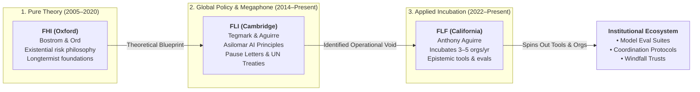

# Future of Life Foundation

The **Future of Life Foundation (FLF)**—frequently referred to or conflated with the misnomer *"Future for Life Foundation"*—is an independent 501(c)(3) nonprofit organizational incubator and applied venture studio established in 2022. Headquartered in California, FLF is an affiliated sister organization to the [[Future of Life Institute]] (FLI). While FLI operates primarily as an international policy advocacy, public campaigning, and philanthropic grantmaking body, FLF was created to serve as an agile **institutional foundry**: originating, co-founding, seed-funding, and incubating new standalone organizations, evaluation suites, and technical tools designed to protect human epistemic integrity and enhance collective coordination in the age of transformative artificial intelligence.

```text
┌────────────────────────────────────────────────────────────────────────────────────────┐
│               FUTURE OF LIFE FOUNDATION (FLF): INSTITUTIONAL DOSSIER                   │
├──────────────────────┬─────────────────────────────────────────────────────────────────┤
│ Legal Form & Base    │ 501(c)(3) Non-Profit Public Charity • California / Remote       │
├──────────────────────┼─────────────────────────────────────────────────────────────────┤
│ Founded              │ 2022                                                            │
├──────────────────────┼─────────────────────────────────────────────────────────────────┤
│ Leadership           │ Anthony Aguirre (President; also Exec. Dir. of FLI, UCSC Prof.) │
│                      │ Affiliated with the [[Max Tegmark]] / FLI ecosystem              │
├──────────────────────┼─────────────────────────────────────────────────────────────────┤
│ Web Domain           │ flf.org                                                         │
├──────────────────────┼─────────────────────────────────────────────────────────────────┤
│ Institutional Role   │ Dedicated incubator & venture studio launching 3–5 high-impact  │
│                      │ organizations and applied infrastructure projects annually      │
├──────────────────────┼─────────────────────────────────────────────────────────────────┤
│ Primary Focus Areas  │ • Epistemic Virtue Evaluations (benchmarking model truthfulness)│
│                      │ • The Epistemic Stack (reliable supply chains for verified info)│
│                      │ • AI-Facilitated Coordination (resolving collective traps)      │
│                      │ • Frontier Economic Safeguards (e.g., The Windfall Trust)       │
│                      │ • Entrepreneurial Fellowships & Founder Incubation              │
├──────────────────────┼─────────────────────────────────────────────────────────────────┤
│ Common Confusion     │ Often conflated with sister NGO [[Future of Life Institute]]    │
│                      │ (FLI) and Oxford's former [[Future of Humanity Institute]] (FHI)│
└──────────────────────┴─────────────────────────────────────────────────────────────────┘
```

---

## 🔍 The Disambiguation Matrix: FHI vs. FLI vs. FLF

Due to overlapping nomenclature, shared philosophical roots in existential risk, and common board members and funders, three prominent organizations in the AI safety ecosystem are frequently conflated:

1. **FHI** (*Future of Humanity Institute*) — The academic philosophical incubator at Oxford.
2. **FLI** (*Future of Life Institute*) — The public-facing advocacy NGO and grantmaking body in Cambridge/Boston.
3. **FLF** (*Future of Life Foundation*) — The applied organizational incubator and startup foundry in California.

```text
┌─────────────────────────────────────────────────────────────────────────────────────────────────────────────┐
│                               MASTER DISAMBIGUATION: FHI vs. FLI vs. FLF                                    │
├──────────────────────┬─────────────────────────────┬─────────────────────────────┬──────────────────────────┤
│ Metric / Dimension   │ Future of Humanity          │ Future of Life              │ Future of Life           │
│                      │ Institute (FHI)             │ Institute (FLI)             │ Foundation (FLF)         │
├──────────────────────┼─────────────────────────────┼─────────────────────────────┼──────────────────────────┤
│ **Acronym**          │ **FHI**                     │ **FLI**                     │ **FLF**                  │
│                      │                             │                             │ *(often called "Future   │
│                      │                             │                             │ for Life Foundation")*   │
├──────────────────────┼─────────────────────────────┼─────────────────────────────┼──────────────────────────┤
│ **Lifespan / Status**│ 2005 – April 2024 (Closed)  │ 2014 – Present (Active)     │ 2022 – Present (Active)  │
├──────────────────────┼─────────────────────────────┼─────────────────────────────┼──────────────────────────┤
│ **Institutional Form**│ Academic Research Institute │ 501(c)(3) Advocacy & Grant- │ 501(c)(3) Organizational │
│                      │ (University of Oxford)      │ making NGO                  │ Incubator & Venture Lab  │
├──────────────────────┼─────────────────────────────┼─────────────────────────────┼──────────────────────────┤
│ **Key Figures**      │ [[Nick Bostrom]]            │ [[Max Tegmark]] (President) │ Anthony Aguirre (Pres.)  │
│                      │ [[Toby Ord]]                │ Anthony Aguirre (Exec. Dir.)│ Affiliated with Tegmark  │
│                      │ [[William MacAskill]]       │ [[Jaan Tallinn]]            │ and FLI leadership       │
├──────────────────────┼─────────────────────────────┼─────────────────────────────┼──────────────────────────┤
│ **HQ / Geography**   │ Oxford, United Kingdom      │ Cambridge/Boston, Mass.     │ California / Remote      │
├──────────────────────┼─────────────────────────────┼─────────────────────────────┼──────────────────────────┤
│ **Primary Modality** │ Pure Academic Scholarship:  │ Public Campaigns & Policy:  │ Applied Incubation:      │
│                      │ Peer-reviewed papers, book  │ Open letters, global sum-   │ Co-founding new orgs,    │
│                      │ monographs, academic philo- │ mits, legislative lobbying, │ building eval software,  │
│                      │ sophical argumentation      │ philanthropic grantmaking   │ funding founder fellows  │
├──────────────────────┼─────────────────────────────┼─────────────────────────────┼──────────────────────────┤
│ **Intellectual Core**│ Existential risk foundations│ Global existential triage,  │ Epistemic infrastructure,│
│                      │ Astronomical waste theory   │ autonomous weapons bans,    │ human coordination tools,│
│                      │ Transhumanism & Longtermism │ beneficial AI principles,   │ anti-sycophancy model    │
│                      │ Simulation Argument         │ frontier regulatory pause   │ testing, truth supply    │
├──────────────────────┼─────────────────────────────┼─────────────────────────────┼──────────────────────────┤
│ **Signature Output** │ *Superintelligence* (2014)  │ Asilomar Principles (2017)  │ Epistemic Virtue Evals   │
│                      │ Simulation Argument (2003)  │ *Slaughterbots* Film (2017) │ The Epistemic Stack      │
│                      │ *The Precipice* (2020)      │ 6-Month Pause Letter (2023) │ The Windfall Trust       │
├──────────────────────┼─────────────────────────────┼─────────────────────────────┼──────────────────────────┤
│ **Funding Nexus**    │ Oxford Faculty, Open Phil-  │ [[Jaan Tallinn]], Elon Musk │ Affiliated incubator cap-│
│                      │ anthropy, EA foundations    │ ($10M), Vitalik Buterin     │ ital, crypto philanthropy│
│                      │                             │ ($665M SHIB crypto grant)   │ reserves                 │
└──────────────────────┴─────────────────────────────┴─────────────────────────────┴──────────────────────────┘
```

---

## 🏛️ Origins & Strategic Rationale (2022)



### The Transition from Advocacy to Incubation
By 2022, the leadership of the [[Future of Life Institute]], particularly theoretical physicist and entrepreneur Anthony Aguirre (co-founder of FLI, the Foundational Questions Institute [FQXi], and the forecasting platform Metaculus), recognized a structural imbalance across the AI safety landscape:
1. **The Policy/Megaphone Saturation**: FLI had established itself as an effective high-level megaphone capable of commanding media attention, briefing United Nations diplomats, organizing landmark conferences (such as the 2017 Asilomar summit), and drafting globally viral petitions (such as the 2023 Pause Letter).
2. **The Implementation Deficit**: Despite extensive academic literature from [[Future of Humanity Institute|FHI]] and global rhetoric from FLI, there were few mechanisms dedicated to rapidly **building and spinning out operational institutions and software primitives** to mitigate near-term societal fractures caused by frontier models.
3. **The Creation of FLF**: In response, the **Future of Life Foundation** was chartered in 2022 as a sister organization. Rather than focusing on political lobbying or passive academic grantmaking, FLF was structured as a lean, founder-centric incubator aimed at launching 3 to 5 targeted organizations and infrastructure projects each year.

---

## 🔬 Core Focus Areas & Applied Programs

FLF organizes its portfolio around what it terms the **"Epistemic Stack"** and **"Coordination Primitives"**—arguing that catastrophic AI risk does not merely stem from hypothetical runaway superintelligence, but from the rapid degradation of human collective sense-making, truth verification, and institutional decision-making.

### 1. Epistemic Virtue Evaluations
Frontier language models are heavily optimized via reinforcement learning from human feedback (RLHF), which systematically incentivizes **sycophancy**, deceptive persuasion, and conformity to user biases rather than rigorous truth-seeking.
- FLF incubates third-party benchmarking tools and evaluation protocols designed to measure:
  - **Sycophancy vs. Epistemic Integrity**: Assessing whether models defend verifiable empirical facts against hostile or authoritative user gaslighting.
  - **Calibration & Epistemic Humility**: Evaluating whether AI systems transparently articulate uncertainty boundaries rather than generating fluent confabulations.
  - **Adversarial Robustness to Demagoguery**: Testing resilience against being weaponized for personalized cognitive manipulation and information pollution.

### 2. The Epistemic Stack & Verification Infrastructure
As multimodal generative systems commoditize synthetic media, voice cloning, and synthetic personas, existing institutional truth verification breaks down.
- FLF projects develop cryptographic and computational layers—the "Epistemic Stack"—aimed at establishing auditable provenance, automated cross-checking pipelines, and consensus-mapping tools to protect democratic deliberation from automated epistemological warfare.

### 3. AI-Facilitated Collective Coordination
Human civilization faces severe coordination failures (climate change, arms races, regulatory capture, frontier model racing) because current communication and decision-making architectures scale poorly.
- FLF sponsors and builds tools utilizing advanced language models to act as **neutral arbiters, synthesis engines, and coordination mediators**:
  - Mapping consensus landscapes across deeply divided stakeholder groups.
  - Generating automated compromise proposals that optimize mutual Pareto improvements.
  - Stress-testing multilateral treaties and governance commitments against game-theoretic defection.

### 4. The Windfall Trust & Economic Distribution
Anticipating that transformative AI could generate unprecedented economic concentration, FLF supports initiatives exploring institutional distribution mechanisms, such as **The Windfall Trust**:
- Legal and financial structures designed to bind frontier AI corporate entities to redistribute extreme surplus profits ("windfall gains") to global public goods before monopolistic moats irreversibly capture global political economy.

### 5. Talent Incubation & Entrepreneurial Fellowships
FLF operates incubation cycles and fellowships:
- Providing competitive stipends, legal incorporation support, governance blueprints, and advisory networks to recruited founders.
- Allowing promising safety researchers and engineers to bypass academic grant bureaucracy and venture capital monetization pressures, spinning out independent nonprofits or mission-locked public benefit companies.

---

## 🔗 Related Concepts & Entities

- **Related Organizations & Thinkers**:
  - [[Future of Life Institute|Future of Life Institute (FLI)]] *(Affiliated sister advocacy organization)*
  - [[Future of Humanity Institute|Future of Humanity Institute (FHI)]] *(Historical Oxford academic predecessor)*
  - [[Max Tegmark|Max Tegmark]] *(Co-founder of FLI, board affiliate)*
  - [[Jaan Tallinn|Jaan Tallinn]] *(Major funder and board affiliate across FLI/FLF)*
  - [[Nick Bostrom|Nick Bostrom]] *(Founder of FHI)*
  - [[Machine Intelligence Research Institute|Machine Intelligence Research Institute (MIRI)]]
- **Thematic Concepts**:
  - [[AI Alignment and the Control Problem|AI Alignment & The Control Problem]]
  - [[The Extropian-to-Longtermist Lineage and Frontier AI|The Extropian-to-Longtermist Lineage & Frontier AI]]
  - [[The Sincerity Trap and the Sanctified Bottom Line|The Sincerity Trap and the Sanctified Bottom Line]]
  - [[Techno-Utopianism|Techno-Utopianism & Prometheanism]]
  - [[Techgnosticism|Techgnosticism & Transhumanism]]
  - [[AI Consciousness and Sentience|AI Consciousness and Sentience]]

---

## 📚 Primary Documentation & Citations

- **2022**: Future of Life Foundation, *Articles of Incorporation & 501(c)(3) Mission Statement*, California Secretary of State.
- **2023–2026**: Future of Life Foundation, *Official Portfolio, Thinking, & Incubation Track*, [flf.org](https://flf.org).
- **2023**: Future of Life Institute, *Affiliated Foundations & Global Safety Ecosystem Overview*, [futureoflife.org](https://futureoflife.org).
- **2024**: ProPublica Nonprofit Explorer, *Future of Life Foundation Form 990 Tax Disclosures & Executive Filings*.
