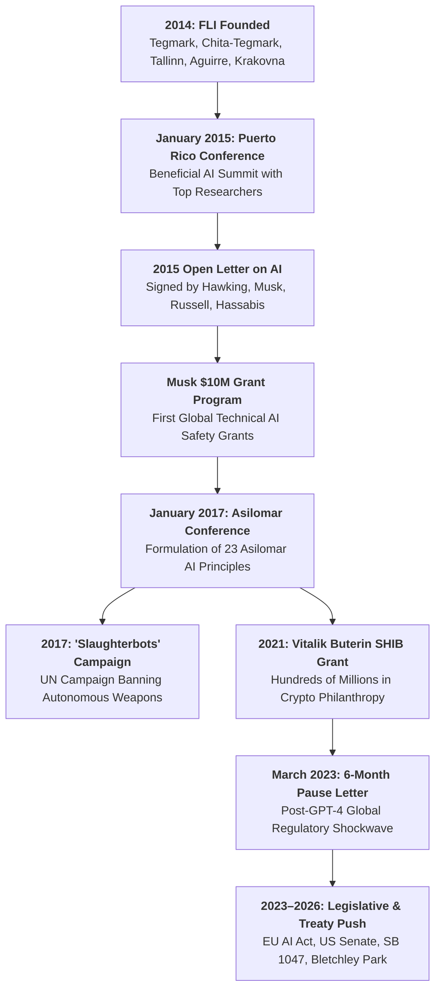

# Future of Life Institute

The **Future of Life Institute (FLI)** is an independent non-profit research, grantmaking, and advocacy organization founded in March 2014 and based in the Boston/Cambridge area, Massachusetts. Co-founded by MIT cosmologist [[Max Tegmark]], Meia Chita-Tegmark, Skype founding engineer [[Jaan Tallinn]], UC Santa Cruz theoretical physicist Anthony Aguirre, and DeepMind researcher Viktoriya Krakovna, FLI focuses on steering transformative technologies away from extreme existential risks toward safeguarding and benefiting life.

Within the broader AI safety and governance landscape, FLI operates as the preeminent **public convening, international policy advocacy, and philanthropic grantmaking NGO**. While the [[Machine Intelligence Research Institute]] (MIRI) pursued pure mathematical agent foundations and Oxford's [[Future of Humanity Institute]] (FHI) developed academic transhumanist philosophy, FLI distinguished itself through high-profile public campaigns, global summits, and coalition-building. FLI organized the historic **2017 Asilomar Conference on Beneficial AI** (which produced the **Asilomar AI Principles**) and authored the March 2023 **"Pause Giant AI Experiments" Open Letter**, which galvanized worldwide regulatory interventions following the release of GPT-4.

```text
┌────────────────────────────────────────────────────────────────────────────────────────┐
│                 FUTURE OF LIFE INSTITUTE (FLI): INSTITUTIONAL DOSSIER                  │
├──────────────────────┬─────────────────────────────────────────────────────────────────┤
│ Legal Form & Base    │ 501(c)(3) Non-Profit NGO • Campbell / Cambridge, Massachusetts  │
├──────────────────────┼─────────────────────────────────────────────────────────────────┤
│ Founded              │ March 2014                                                      │
├──────────────────────┼─────────────────────────────────────────────────────────────────┤
│ Co-Founders          │ [[Max Tegmark]] (President, MIT Physics Professor)              │
│                      │ Anthony Aguirre (Executive Director, UCSC Physics Professor)│
│                      │ Meia Chita-Tegmark (Co-Founder, Cognitive Scientist)            │
│                      │ [[Jaan Tallinn]] (Co-Founder, Skype Founding Engineer, Funder)  │
│                      │ Viktoriya Krakovna (Co-Founder, DeepMind Research Scientist)│
├──────────────────────┼─────────────────────────────────────────────────────────────────┤
│ Advisory Board       │ Alan Alda, Nick Bostrom, George Church, Morgan Freeman,         │
│                      │ Stephen Hawking (posthumous), Elon Musk, Martin Rees,           │
│                      │ Francesca Rossi, Stuart Russell, Frank Wilczek                  │
├──────────────────────┼─────────────────────────────────────────────────────────────────┤
│ Major Focus Areas    │ • Artificial General Intelligence (Technical Safety & Policy)   │
│                      │ • Lethal Autonomous Weapons Systems (LAWS / "Slaughterbots")   │
│                      │ • Nuclear Non-Proliferation & De-escalation                     │
│                      │ • Synthetic Biotechnology & Planetary Ecological Boundaries     │
├──────────────────────┼─────────────────────────────────────────────────────────────────┤
│ Signature Milestones │ • 2015 Puerto Rico Conference ($10M Elon Musk AI Safety Fund)   │
│                      │ • 2017 Asilomar AI Principles (23 Governance Benchmarks)        │
│                      │ • 2017 *Slaughterbots* Global UN Disarmament Campaign           │
│                      │ • 2021 Vitalik Buterin SHIB Crypto Philanthropy (~$665M Grant)  │
│                      │ • 2023 "Pause Giant AI Experiments" Open Letter (>30,000 sign.) │
├──────────────────────┼─────────────────────────────────────────────────────────────────┤
│ Ecosystem Role       │ Public-facing institutional megaphone, bridge between academia, │
│                      │ tech billionaires, UN diplomacy, and federal AI legislation     │
└──────────────────────┴─────────────────────────────────────────────────────────────────┘
```

---

## 🏛️ 1. Origins & Foundational Architecture (2014–2016)



### The Cambridge Inception (2014)
In early 2014, Swedish-American cosmologist [[Max Tegmark]]—inspired by conversations with Skype co-founder [[Jaan Tallinn]] and the publication of [[Nick Bostrom]]'s *Superintelligence*—concluded that the greatest existential threat to the cosmological future of consciousness did not stem from astrophysical catastrophes (supernovae, asteroid impacts) but from humanity's own emerging technological powers:
- In March 2014, Tegmark organized an initial dinner in Cambridge, Massachusetts, co-founding FLI alongside his spouse Meia Chita-Tegmark, Tallinn, UC Santa Cruz theoretical cosmologist Anthony Aguirre (co-founder of FQXi and Metaculus), and DeepMind researcher Viktoriya Krakovna.
- While Eliezer Yudkowsky’s [[Machine Intelligence Research Institute|MIRI]] focused exclusively on insular mathematical logic and Bostrom’s [[Future of Humanity Institute|FHI]] focused on Oxford academic philosophy, FLI was intentionally designed as an **outward-facing action network**: convening elite scientists, enlisting cultural figures, lobbying policymakers, and deploying catalytic philanthropic capital.

### The 2015 Puerto Rico Conference & Musk's $10 Million Fund
In January 2015, FLI hosted its first landmark international gathering: the **Conference on the Future of AI: Opportunities and Challenges** in San Juan, Puerto Rico:
- The conference brought together mainstream artificial intelligence luminaries (Stuart Russell, Yann LeCun, Bart Selman), neuroscientists and entrepreneurs ([[Demis Hassabis]], [[Shane Legg]], Elon Musk), and safety theorists.
- FLI drafted and released the **"Open Letter on Research Priorities for Robust and Beneficial Artificial Intelligence"**, signed by theoretical physicist Stephen Hawking, Elon Musk, Stuart Russell, and dozens of top AI laboratory directors. The letter formally marked the transition of AI safety from a fringe rationalist preoccupation into a recognized scientific discipline.
- At the conference, **Elon Musk announced a $10 million personal philanthropic grant** to FLI. FLI established an open competitive grant program, distributing tens of millions of dollars to academic research labs worldwide to study value alignment, verification, algorithmic transparency, and legal accountability.

---

## 📜 2. The Asilomar AI Principles (2017)

In January 2017, FLI convened the **Beneficial AI 2017 Conference** in Asilomar, California—deliberately mirroring the historic 1975 Asilomar Conference on Recombinant DNA where biologists established self-imposed safety guidelines for genetic engineering.

The conference brought together over 100 leaders from computer science, robotics, economics, legal scholarship, and philosophy to debate and vote on governance standards for artificial intelligence. The outcome was the **23 Asilomar AI Principles**, divided into three distinct operational domains:

```text
┌────────────────────────────────────────────────────────────────────────────────────────┐
│                        THE ASILOMAR AI PRINCIPLES (2017) CORE TIERS                    │
├──────────────────────────┬─────────────────────────────────────────────────────────────┤
│ Domain                   │ Core Principles & Mandates                                  │
├──────────────────────────┼─────────────────────────────────────────────────────────────┤
│ **1. Research Issues**   │ • **Goal**: To create not undirected intelligence, but      │
│                          │   *beneficial* intelligence.                                │
│                          │ • **Investment**: Sustained funding for safety verification,│
│                          │   formal validation, security, and control.                 │
│                          │ • **Science-Policy Link**: Constructive cross-collaboration.│
│                          │ • **Culture**: Openness, cooperation, and trust between labs│
├──────────────────────────┼─────────────────────────────────────────────────────────────┤
│ **2. Ethics & Values**   │ • **Safety & Transparency**: Systems must operate safely    │
│                          │   under verifiable auditing; explainable decisions.         │
│                          │ • **Value Alignment**: Systems should align with human      │
│                          │   dignity, rights, freedoms, and cultural diversity.        │
│                          │ • **Shared Prosperity**: AI economic benefits must broadly  │
│                          │   benefit all of humanity; avoiding extreme inequality.     │
│                          │ • **Human Control**: Humans must choose how and whether to  │
│                          │   delegate autonomous decisions to AI systems.              │
├──────────────────────────┼─────────────────────────────────────────────────────────────┤
│ **3. Longer-Term Issues**│ • **Capability Caution**: No consensus on an upper bound on │
│                          │   future AI capabilities; plan for high impact.             │
│                          │ • **Non-Subversion**: AI planning must respect human        │
│                          │   sovereignty and prevent catastrophic loss of control.     │
│                          │ • **Superintelligence**: Superintelligence should only be   │
│                          │   developed in service of widely shared ethical ideals.     │
│                          │ • **Arms Race Avoidance**: Labs must avoid reckless races   │
│                          │   that compromise safety thresholds.                        │
└──────────────────────────┴─────────────────────────────────────────────────────────────┘
```

The Asilomar Principles were signed by over 1,200 AI researchers and nearly 4,000 global experts, including [[Demis Hassabis]], [[Sam Altman]], Yoshua Bengio, Stuart Russell, Geoffrey Hinton, Ray Kurzweil, and Stephen Hawking. In 2018, the State of California formally recognized the Asilomar Principles via Assembly Concurrent Resolution (ACR 215), cementing them as an early foundational blueprint for global AI ethics frameworks, OECD AI principles, and corporate governance charters.

---

## 🛑 3. Arms Control & The "Slaughterbots" Campaign (2017–2022)

Beyond generative models and superintelligence, FLI positioned itself as the leading international civil society voice campaigning against **Lethal Autonomous Weapons Systems (LAWS)**:

1. **The Campaign to Stop Killer Robots**:
   - Collaborating closely with UC Berkeley computer science professor **Stuart Russell**, FLI argued that delegating lethal targeting decisions to software algorithms without meaningful human control removes human moral accountability, destabilizes geopolitics, and creates catastrophic proliferation risks.
2. **The *Slaughterbots* Phenomenon (2017)**:
   - In November 2017, FLI and Stuart Russell premiered the short speculative film ***Slaughterbots*** at the United Nations Convention on Certain Conventional Weapons (CCW) in Geneva.
   - The film dramatized a plausible near-future scenario where commercial micro-drones equipped with facial recognition, shaped explosives, and swarm-intelligence algorithms are mass-produced and deployed by non-state actors for targeted political assassinations and ethnic slaughter.
   - The video went viral globally, accumulating tens of millions of views and permanently altering the public imagination around autonomous weapons.
3. **The 2021 Sequel & UN Treaty Advocacy**:
   - In 2021, FLI released *Slaughterbots: If Human: Kill()*, intensifying its diplomatic campaign for a legally binding international treaty under the United Nations to ban autonomous targeting of humans.

---

## ⚡ 4. The 2023 "Pause Giant AI Experiments" Open Letter

On March 22, 2023—one week after [[OpenAI]] unveiled **GPT-4**—FLI ignited the most intense global regulatory debate in the history of computing by publishing **"Pause Giant AI Experiments: An Open Letter"**.

```text
┌────────────────────────────────────────────────────────────────────────────────────────┐
│               "PAUSE GIANT AI EXPERIMENTS: AN OPEN LETTER" (MARCH 2023)                │
├──────────────────────┬─────────────────────────────────────────────────────────────────┤
│ Core Demand          │ An immediate, public, verifiable **6-month pause** by all AI    │
│                      │ labs on training any AI systems more powerful than GPT-4.       │
├──────────────────────┼─────────────────────────────────────────────────────────────────┤
│ Enforcement Fallback │ If a pause cannot be enacted quickly, governments should step   │
│                      │ in and institute a mandatory regulatory moratorium.             │
├──────────────────────┼─────────────────────────────────────────────────────────────────┤
│ Stated Objective     │ Use the pause to jointly develop and implement a set of shared  │
│                      │ safety protocols for advanced AI design and development,        │
│                      │ audited and overseen by independent outside experts.            │
├──────────────────────┼─────────────────────────────────────────────────────────────────┤
│ Key Signatories      │ Yoshua Bengio (Turing Laureate), Stuart Russell, Elon Musk,     │
│                      │ Steve Wozniak (Apple co-founder), Yuval Noah Harari, Gary       │
│                      │ Marcus, Andrew Yang, Jaan Tallinn, Max Tegmark.                 │
├──────────────────────┼─────────────────────────────────────────────────────────────────┤
│ Total Endorsements   │ >33,000 verified signatures from scientists, engineers, and     │
│                      │ civil society leaders within weeks of publication.              │
└──────────────────────┴─────────────────────────────────────────────────────────────────┘
```

### The Global Policy Shockwave
The 6-Month Pause letter transformed AI safety from an esoteric tech-industry debate into an urgent geopolitical priority:
- **Senate Inquiries**: Led directly to the historic May 2023 US Senate Judiciary Subcommittee hearings where [[Sam Altman]], Gary Marcus, and Christina Montgomery testified on federal licensing frameworks for frontier models.
- **International Summits**: Catalyzed UK Prime Minister Rishi Sunak’s convening of the **Bletchley Park AI Safety Summit** (November 2023), resulting in the Bletchley Declaration signed by the US, UK, EU, and China.
- **Legislative Tightening**: Provided political momentum for the drafting of the **EU AI Act's** General Purpose AI (GPAI) systemic risk rules and California’s controversial **SB 1047** (Safe and Secure Innovation for Frontier Artificial Intelligence Models Act).

### The Three-Way Intellectual Backlash
The Pause letter provoked simultaneous condemnation from across the ideological spectrum:
1. **The MIRI / Fatalist AI Realist Critique**:
   - Decision theorist [[Eliezer Yudkowsky]] published an op-ed in *Time* magazine (*"Pausing AI Developments Isn't Enough. We Need to Shut It All Down"*, March 29, 2023), arguing that a 6-month pause was grossly inadequate theater. Yudkowsky argued that humanity was decades away from solving mathematical alignment and called for an indefinite global shutdown backed by military strikes on unauthorized data centers.
2. **The Technocapitalist / Accelerationist (e/acc) Critique**:
   - Silicon Valley venture capitalists (notably Marc Andreessen in *The Techno-Optimist Manifesto*) and computer scientists like Yann LeCun attacked FLI as panic-mongering "doomer lobbyists" engaging in Baptist-and-bootlegger regulatory capture designed to stifle open-source AI and entrench incumbents.
3. **The Critical AI Ethics Critique**:
   - Scholars such as Timnit Gebru, Joy Buolamwini, and Emily M. Bender argued that the Pause letter hyper-focused public attention on hypothetical sci-fi extinction risks while systematically ignoring immediate, existing harms: copyright theft, labor exploitation in data annotation, environmental compute consumption, algorithmic racial bias, and surveillance capitalism.

---

## 💰 5. Philanthropic Capital & The Crypto Windfall (2021–2026)

FLI’s financial trajectory exemplifies the unique intersection of modern tech philanthropy, cryptocurrencies, and existential risk:

- **The Vitalik Buterin SHIB Gift (May 2021)**:
  - In May 2021, Ethereum creator **Vitalik Buterin** received an unsolicited airdrop of half the supply of the meme token Shiba Inu (SHIB).
  - Rather than selling or retaining the tokens, Buterin donated **$665 million worth of SHIB** to the Future of Life Institute (alongside a massive donation to India’s CryptoRelief fund).
  - FLI structured a measured, long-term liquidation strategy with Buterin to avoid crashing token markets, establishing a dedicated multi-hundred-million-dollar existential risk grantmaking endowment.
- **Grantmaking Expansion**:
  - The windfall transformed FLI from a lean, campaign-oriented NGO into one of the best-funded non-governmental scientific grantmakers in the world, distributing multi-million-dollar annual awards for AI safety engineering, biosecurity defense, and nuclear non-proliferation research across university campuses globally.

---

## 🧠 6. Theoretical Framework: Max Tegmark's *Life 3.0*

FLI’s intellectual orientation is heavily shaped by co-founder [[Max Tegmark]]’s bestselling 2017 treatise, ***Life 3.0: Being Human in the Age of Artificial Intelligence***:

```text
┌────────────────────────────────────────────────────────────────────────────────────────┐
│                        TEGMARK'S THREE-TIERED EVOLUTION OF LIFE                        │
├──────────────────────────┬─────────────────────────────────────────────────────────────┤
│ Stage of Life            │ Definition & Evolutionary Constraints                       │
├──────────────────────────┼─────────────────────────────────────────────────────────────┤
│ **Life 1.0 (Biological)**│ • Hardware and software are both biological and evolved;    │
│                          │   cannot redesign either during lifetime (bacteria, plants).│
├──────────────────────────┼─────────────────────────────────────────────────────────────┤
│ **Life 2.0 (Cultural)**  │ • Hardware is evolved, but software is designed; can learn, │
│                          │   acquire culture, language, and software skills (Humans).  │
├──────────────────────────┼─────────────────────────────────────────────────────────────┤
│ **Life 3.0 (Techno)**    │ • Can redesign both its software *and* its physical hardware│
│                          │   at will; recursive self-improving artificial intelligence.│
└──────────────────────────┴─────────────────────────────────────────────────────────────┘
```

Tegmark argues that consciousness—the subjective experience of "what it is like" to be an information-processing system—is the ultimate bearer of cosmological value. In his view, human intelligence is merely a fragile stepping stone: the emergence of Life 3.0 allows the cosmos to wake up, spread across galaxies, and preserve consciousness for billions of years, *provided* that humanity successfully solves value alignment before creating runaway recursive systems.

---

## 🔍 7. Critical Analysis & Political Economy

### The Sincerity Trap & The Longtermist Transmission Belt
In *More Everything Forever* (2025) and on *Better Offline* (September 2026), science historian [[Adam Becker]] and computer scientist [[Cal Newport]] evaluated FLI’s institutional role within the broader **[[The Extropian-to-Longtermist Lineage and Frontier AI|Extropian-to-Longtermist Lineage]]**:
- **The Respectability Machine**: While MIRI represented the insular, intense rationalist fringe and FHI represented Oxford academic abstraction, FLI functioned as the high-gloss **institutional PR and mobilization arm** of the movement.
- **The "Sincerity Trap" Paradox**: Becker and Newport highlight how FLI's high-decibel campaigns paradoxically benefited the very frontier labs they sought to restrain. By framing frontier models as potentially omnipotent entities capable of wiping out humanity, FLI inadvertently validated the marketing hype of [[OpenAI]], [[Anthropic]], and [[Google DeepMind]]. Investors poured hundreds of billions into frontier labs partly because FLI’s warnings convinced capital markets that these systems were on the verge of godlike general capabilities ([[The Sincerity Trap and the Sanctified Bottom Line|The Sincerity Trap]]).

---

## 🔗 Related Concepts & Entities

- **Concepts**:
  - [[The Extropian-to-Longtermist Lineage and Frontier AI|The Extropian-to-Longtermist Lineage & Frontier AI]]
  - [[TESCREAL and The Merge|TESCREAL & The Merge]]
  - [[AI Alignment and the Control Problem|AI Alignment & The Control Problem]]
  - [[The Sincerity Trap and the Sanctified Bottom Line|The Sincerity Trap and the Sanctified Bottom Line]]
  - [[The Epistemology of Evasion and AI Legal Strategy|The Epistemology of Evasion and AI Legal Strategy]]
  - [[Scaling Laws and The Bitter Lesson|Scaling Laws & The Bitter Lesson]]
  - [[Techno-Utopianism|Techno-Utopianism & Prometheanism]]
  - [[Techgnosticism|Techgnosticism & Transhumanism]]
- **Entities**:
  - [[Max Tegmark|Max Tegmark]]
  - [[Jaan Tallinn|Jaan Tallinn]]
  - [[Future of Humanity Institute|Future of Humanity Institute (FHI)]]
  - [[Machine Intelligence Research Institute|Machine Intelligence Research Institute (MIRI)]]
  - [[Eliezer Yudkowsky|Eliezer Yudkowsky]]
  - [[Nick Bostrom|Nick Bostrom]]
  - [[Stuart Russell|Stuart Russell]]
  - [[Demis Hassabis|Demis Hassabis]]
  - [[Shane Legg|Shane Legg]]
  - [[Sam Altman|Sam Altman]]
  - [[Dario Amodei|Dario Amodei]]
  - [[OpenAI|OpenAI]]
  - [[Anthropic|Anthropic]]
  - [[Google DeepMind|Google DeepMind]]
  - [[Adam Becker|Adam Becker]]
  - [[Cal Newport|Cal Newport]]
  - [[Better Offline|Better Offline]]
  - [[Chad Woodford|Chad Woodford]]

---

## 📚 Primary Sources & Key Works

- **2015-01-11**: Future of Life Institute, *"Open Letter on Research Priorities for Robust and Beneficial Artificial Intelligence"* (Puerto Rico Conference).
- **2017-01-08**: Future of Life Institute, *"Asilomar AI Principles"*, Beneficial AI 2017 Conference.
- **2017-08-29**: Max Tegmark, *Life 3.0: Being Human in the Age of Artificial Intelligence*, Alfred A. Knopf.
- **2017-11-12**: Future of Life Institute & Stuart Russell, *"Slaughterbots"* (Short Film / Campaign to Stop Killer Robots).
- **2023-03-22**: Future of Life Institute, *"Pause Giant AI Experiments: An Open Letter"*.
- **2025**: Adam Becker, *More Everything Forever: AI, Transhumanism, and the Venture Capital Quest for the Singularity*, Basic Books.
- **2026-09-18**: Cal Newport & Adam Becker, *"The Transhumanist Roots of AI Doomerism"*, *Better Offline* Podcast.
